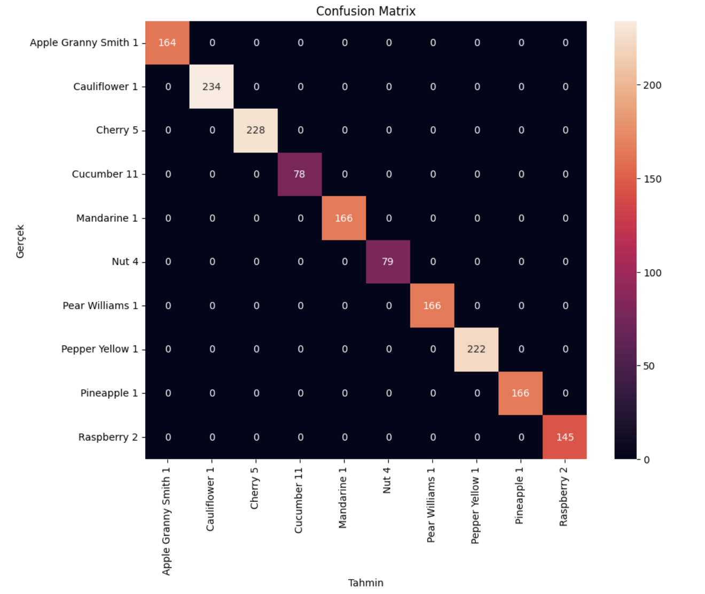
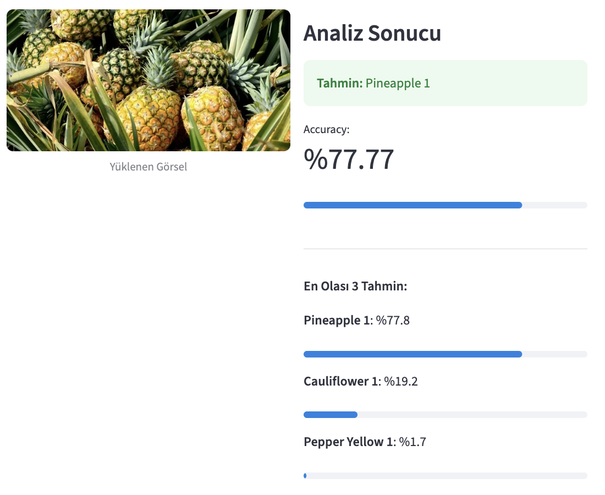
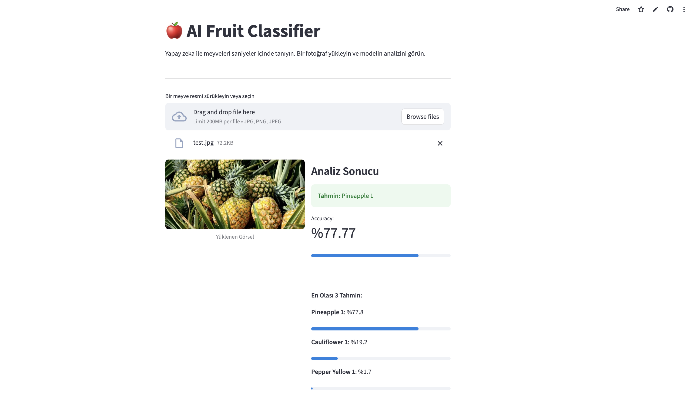
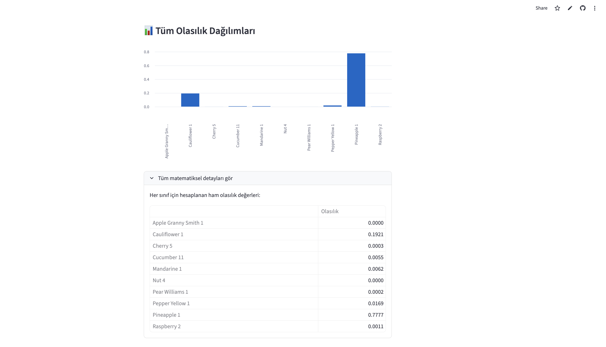

# 🍎 Fruit Classification with Transfer Learning & Streamlit Deployment


Bu proje, derin öğrenme ve **Transfer Learning** (Transferli Öğrenme) tekniklerini kullanarak meyve türlerini yüksek doğrulukla sınıflandırmayı amaçlayan uçtan uca bir yapay zeka uygulamasıdır. **MobileNetV2** mimarisi üzerinde inşa edilen model, Google Colab ortamında eğitilmiş ve **Streamlit** kullanılarak canlı bir web uygulaması olarak yayına alınmıştır.

## 🌐 Live Demo
Uygulamayı tarayıcınızda hemen deneyin:  
👉 **[Fruit Classification Web App](https://transfer-learning-fruit-classification-lkuw4qf9tyjw9kzvd6uad3.streamlit.app/)** 

---

## 🚀 Proje Genel Bakışı
Proje kapsamında **Fruits-360** veri setinden seçilen 10 farklı meyve sınıfı (Apple Granny Smith, Pineapple, Raspberry, Mandarine, Cauliflower, Pepper Yellow, Pear Williams, Cucumber, Cherry, Nut) üzerinde çalışılmıştır. Proje, sadece bir sınıflandırma modeli geliştirmeyi değil, aynı zamanda modelin gerçek dünya verilerine adaptasyonunu ve dağıtımını (deployment) kapsamaktadır.

---

## 🧠 Model Mimari ve Eğitim Süreci
Modelin geliştirilmesinde **MobileNetV2** temel alınmış, ancak kıyaslama amacıyla **ResNet50** ve **VGG16** mimarileri de test edilmiştir. MobileNetV2, mobil ve uç cihazlar için optimize edilmiş yapısı (Lightweight) sayesinde tercih edilmiştir.


### Eğitim Stratejileri:
1. **Feature Extraction (Özellik Çıkarımı):** `ImageNet` ağırlıkları ile başlatılan MobileNetV2'nin alt katmanları dondurulmuş (frozen), sadece yeni eklenen classification başlığı eğitilmiştir.
2. **Fine-Tuning (Hassas Ayarlama):** Modelin son 20 katmanının kilidi açılarak, düşük bir öğrenme oranı (`learning_rate=1e-5`) ile meyve veri setinin spesifik detaylarına adapte olması sağlanmıştır.
3. **Data Augmentation (Veri Artırımı):** Modelin rotasyon, kaydırma ve zoom gibi varyasyonlara karşı dayanıklılığını artırmak için `ImageDataGenerator` kullanılarak sentetik veriler oluşturulmuştur.

---

## 📊 Model Performansı ve Analiz
Eğitim sürecinde farklı mimariler (ResNet50, VGG16 ve MobileNetV2) test edilmiş, hız ve performans dengesi nedeniyle **MobileNetV2** tercih edilmiştir.


* ### Confusion Matrix
Modelin sınıflar arasındaki performansını ve hangi meyveleri birbiriyle karıştırdığını analiz etmek için kullanılan karmaşıklık matrisi:

<p align="center">
  
</p>

<br>

* ### Tahmin Örnekleri (Inference)
Modelin gerçek dünya verileri (Distribution Shift) üzerindeki performansı:

| Gerçek Class | Tahmin Edilen | Confidence |
| :--- | :--- | :--- |
| Pineapple | Pineapple | %91.7 |
| Raspberry | Raspberry | %100.0 |

<br>
<p align="center">
  
</p>


---

## 🛠 Kullanılan Teknolojiler
* **Deep Learning Framework:** TensorFlow & Keras
* **Pre-trained Models:** MobileNetV2, ResNet50, VGG16
* **Deployment:** Streamlit & GitHub Actions
* **Data Handling:** NumPy, Pandas, Pillow
* **Visualization:** Matplotlib, Seaborn


---

## 💻 Uygulama Özellikleri
Canlı yayındaki uygulama şu yeteneklere sahiptir:
* **Anlık Tahmin:** Kullanıcı tarafından yüklenen resimleri saniyeler içinde analiz eder.
* **Top-3 Tahmin:** Sadece en yüksek tahmini değil, en olası ilk 3 sınıfı olasılık değerleriyle gösterir.
* **Olasılık Dağılım Grafiği:** Modelin tüm sınıflar üzerindeki güven skorlarını görselleştirir.
* **Interaktif UI:** Profesyonel ve kullanıcı dostu arayüz tasarımı.

<p align="center">
  
</p>
<p align="center">
  
</p>

---
## 🧠 Karşılaşılan Teknik Sorunlar ve Mühendislik Çözümleri
Proje geliştirme sürecinde karşılaşılan ve çözüme kavuşturulan önemli teknik engeller:
* **Versiyon Uyumsuzluğu:** Colab (TF 2.19) ile Streamlit Cloud (TF 2.15) arasındaki serileştirme farkı, modelin bütün olarak yüklenmesi yerine mimarinin kodla tanımlanıp sadece ağırlıkların (`.h5`) enjekte edilmesiyle çözülmüştür.
* **Input Boyutu Senkronizasyonu:** Eğitimde kullanılan 224x224 boyutunun Streamlit tarafında da korunması sağlanarak tahmin doğruluğu %77 seviyesine yükseltilmiştir.
* **Sınıf İndeksi Senkronizasyonu:** Sayısal çıktıların (0-9) doğru meyve isimleriyle eşleşmesi için `class_indices` sözlüğü manuel olarak doğrulanmıştır.

---

## ⚙️ Kurulum ve Çalıştırma

Projeyi yerelinizde çalıştırmak için:

1. Depoyu klonlayın:
```bash
git clone [https://github.com/beyzahiz/Transfer-Learning-Fruit-Classification.git](https://github.com/beyzahiz/Transfer-Learning-Fruit-Classification.git)
```
2. Gerekli kütüphaneleri yükleyin:
```bash
pip install -r requirements.txt
```
3. Uygulamayı başlatın:
```bash
streamlit run app.py
```
